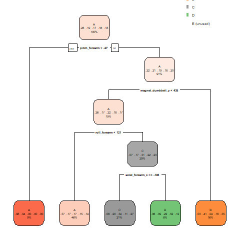

```{r setup, include=FALSE, default=FALSE}
knitr::opts_chunk$set(
	echo = TRUE,
	message = FALSE,
	warning = FALSE
)
```

This project uses data from accelerometers on the belt, forearm, arm and dumbbell of 6 participants.They were asked to perform barbell lifts correctly and incorrectly in 5 different ways. The data for this project come from this source: http://web.archive.org/web/20161224072740/http:/groupware.les.inf.puc-rio.br/har.

**The goal of the project** is to predict how the participants performed the exercise. This is the "class" variable in the training set.

**Reproducibility** For security reasons when sharing R code, the code will not run during evaluation.

**Analysis. Summary of approach:**
Download the dataset and briefly examine the characteristics of the data. We are performing a preliminary analysis. Data cleanup: delete columns with missing values, remove variables that cannot be predictors. Using the cross-validation method, we will build a valid model; 70% of the source data is used to build the model (training data), and the remaining 30% of the data is used for testing (testing data). We build several models using different methods: recursive partitioning, Random Forest, booster trees, put the forecasts together using “rf”. We select the model with the highest resulting accuracy and apply it to evaluate classes of 20 observations.

**Using libraries**
```{r, default=FALSE }
library(pgmm);library(rpart);library(gbm); library(lubridate); library(forecast);
library(e1071);library(AppliedPredictiveModeling);library(caret);
library(dplyr); library(ISLR);library(rpart.plot);library(randomForest)
library(ggplot2);library(mgcv);library(nlme)

```

### Reading the data
Read the training data into R, identifying “NA”, “” and “#DIV/0!” as NA strings:

```{r, default=FALSE }
datTrain1<-read.csv("/Users/Toshiba/Documents/CourseProjectPracticalMachineLearning/pml-training.csv",
                    na.strings=c("NA","#DIV/0!", ""))
datTest2<-read.csv("/Users/Toshiba/Documents/CourseProjectPracticalMachineLearning/pml-testing.csv",
                   na.strings=c("NA","#DIV/0!", ""))


```

##### Explore with head(), tail(), str() 
### Delete columns with all missing values:

```{r, default=FALSE }
datTrain1<-datTrain1[,colSums(is.na(datTrain1)) == 0]
datTest2 <-datTest2[,colSums(is.na(datTest2)) == 0]

```

### variable names in training and test  datasets.
### Removing variables that cannot become predictors:

```{r, eval= FALSE, default=TRUE}
str(datTrain1);str(datTest2)
datTrain<-select(datTrain1,-c(X,user_name,num_window,new_window,cvtd_timestamp))
datTest<-select(datTest2, -c(X,user_name,problem_id,cvtd_timestamp,new_window,num_window ))
dim(datTrain);dim(datTest); 

```
### Partioning Training data set (datTrain) into two data sets, 70% for TrainingSet,
### 30% for TestingSet:

```{r, eval= FALSE}
set.seed(1507)
inTrain <- createDataPartition(y=datTrain$classe, p=0.7, list=FALSE)
TrainingSet1 <- datTrain[inTrain, ]; TestingSet1 <- datTrain[-inTrain, ]
dim(TrainingSet1); dim(TestingSet1)
TrainingSet1$classe<-as.factor(TrainingSet1$classe)
TestingSet1$classe<-as.factor(TestingSet1$classe)

```

### 1. method rpart (recursive partitioning), Prediction model 1:

```{r, eval= FALSE}
modfit1 <- train(classe ~. , data=TrainingSet1, method="rpart")

```
### Predicting and Test results on TestingSet1 data set:
```{r, eval= FALSE}
prediction1<-predict(modfit1,TestingSet1)
confusionMatrix(TestingSet1$classe, prediction1)$overall['Accuracy']
rpart.plot(modfit1$finalModel)

```

```{r pressure, echo=FALSE, fig.cap="plot1", out.width = '50%'}

```


### 2. methood Random Forest, Prediction model 2:

```{r, eval= FALSE}
modfit2 <-train(classe ~., data=TrainingSet1, method="rf")
prediction2<- predict(modfit2, TestingSet1)
cm2<-confusionMatrix(TestingSet1$classe, prediction2)
confusionMatrix(TestingSet1$classe, prediction2)$overall['Accuracy']

```

### Dependence of the error on the training sample on the number of aggregated   
### trees during bagging and using the “random forest” algorithm: 

```{r, eval= FALSE}
plot(modfit2$finalModel)

```
#### plot

```{r plot, echo=FALSE,  out.width = '50%'}


```


###  Individual Variable Importance Scores for a Random Forest Model2: 


```{r , echo=FALSE, fig.cap="plot3", out.width = '60%'}


```

### 3. method "gbm"(booster trees) , Prediction model3:  

```{r, eval= FALSE}
modfit3 <- train(classe ~. , data=TrainingSet1, method="gbm", verbose=FALSE)
prediction3<-predict(modfit3,TestingSet1)
confusionMatrix(TestingSet1$classe, prediction3)$overall['Accuracy']

```

### 4. Let's add the previous predıctıons together, use the method "rf", Model4:

```{r, eval= FALSE}
predDF<-data.frame(prediction1,prediction2,prediction3, classe=TestingSet1$classe)
modfit4<-train(classe ~. , data=predDF, method="rf")
prediction4<-predict(modfit4, TestingSet1)
confusionMatrix(TestingSet1$classe, prediction4)$overall['Accuracy']
```

## **Conclusions:** model 2 has the highest accuracy. Apply it to 20 test cases:

```{r, eval= FALSE}
preddatTest2 <- predict(modfit2, newdata = datTest2)
preddatTest2
confusionMatrix(datTest2$classe, preddatTest2)

```
### Prediction result:                                       
[1] B A B A A E D B A A B C B A E E A B B B             

Levels: A B C D E


